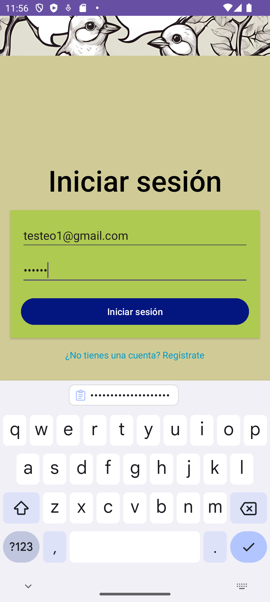
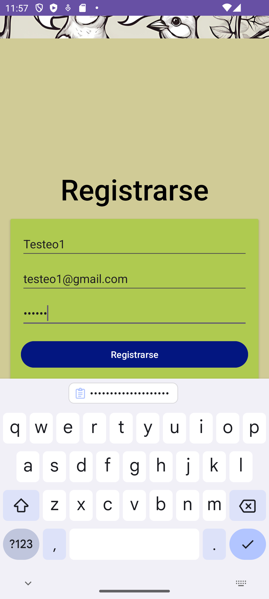

# Chatty
*Chatt Application for the Advanced Mobile Development course of Todos a la U.*
## Objetivo:
Chatty es un aplicación básica de chat que permite a los usuarios registrados comunicarse entre sí mediante mensajes de texto.
## Tecnologías Usadas:
Las siguientes son las tecnologías usadas para el desarrollo y funcionamiento de la aplicación:
* **Java:** Este lenguaje de programación multiplataforma fue usado para establecer la lógica de la aplicación.
* **Android Studio:** Es el IDE (Entorno de Desarrollo Integrado) que se usó para la construcción y prueba de la aplicación. Tanto para la creación de la lógica de negocio como para el diseño de la interfaz de usuario.
* **Sqlite:** Motor de bases de datos usado en la aplicación para el almacenamiento de datos en el dispositivo.
* **Firebase:** Plataforma en la nube para la administración y sincronización de una base de datos en línea que sirva de backup para la información de usuarios, autenticación y funcionamiento de la aplicación.
## Usuario Objetivo:
El usuario objetivo es una persona que requiere de un servicio para poder comunicarse con otros usuarios a distancia mediante su dispositivo móvil. No requiere de funcionalidades avanzadas y prefiere la comunicación mediante mensaje de texto. Sus necesidas relacionadas a su historia de usuario comprenden:
* La aplicación debe permitirme el registrarme e ingresar con un usuario y contraseña únicos que me garanticen la seguridad de mis mensajes.
* La aplicación debe permitirme poder chatear mediante mensajes en texto con otros usuarios.
## Requerimientos Funcionales:
De acuerdo con las historias de usuario, las funcionalidades implementadas corresponden a:
### *Pantalla de Inicio:*
Cada usuario tiene acceso a una pantalla de inicio en la que puede indicar el correo electrónico del usuario y su contraseña. La aplicación no permite el ingreso de un usuario no registrado y contiene un enlace para pasar a la pantalla de registro para que el usuario proceda con este flujo de negocio en caso de no tener usuario.
### *Pantalla de Registro:*
Presenta un formulario para el registro de los usuarios. Requiriendo el nombre de usuario, correo electrónico y contraseña. La aplicación no permite el ingreso de una contraseña menor a seis dígitos. Una vez diligenciado y creado el usuario, la aplicación redirige a la pantalla de inicio.
### *Pantalla de Chat:*
El usuario escribe el correo de la persona con quien desea chatear y realiza su búsqueda, posteriormente puede hacer click en un botón para iniciar el chat con esa persona. Para enviar un mensaje tiene la posibilidad de escribirlo en un cuadro de texto en la parte inferior de la pantalla.
## Diagrama de Entidad Relación:

[Ver el diagrama](https://drive.google.com/file/d/1X3jI2KWnE9Oxwfj1h2GWtQKo1Z-dteU5/view?usp=sharing)

## Diagrama de Clases:

[Ver el diagrama](https://drive.google.com/file/d/1odp3mG_hzC9dOr5pV8x-lQmO-L2lCb5J/view?usp=sharing)

## Ejecución de la aplicación:

### *Pantalla de Inicio:*

### *Inicio de Sesión:*

### *Registro de Usuario:*

### *Ventana de Chat y mensajes existentes:*

### *Video de ejecución de la aplicación:*

[Ver el video](https://www.youtube.com/embed/QJJEKAy3p84?si=aGPZKTM3vCkyoPEF)

## Observaciones Adicionales:

### *Reunión de miembros de equipo:*
*No aplicable, el proyecto se desarrollo individualmente.*
### *Actividades en Trello/Jira:*
*No aplicable, el proyecto se desarrollo individualmente.*

